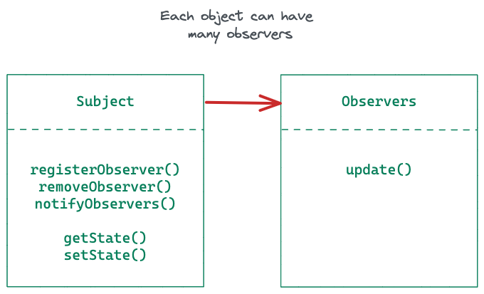
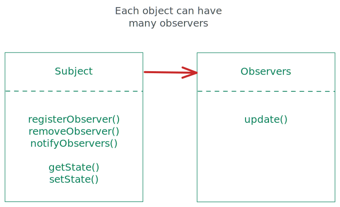

# Observer Pattern

**Observer Pattern** defines a one-to-many dependency between objects so that when one object changes state, all of its dependents are notifies and updated automatically.  


## Loose Coupling

We are following the principle of loose-coupling by allowing observers to be independent of the publisher object.  

`WeatherData` class can be developed without being too much concerned about any of the observers that may want to use the state from it.  
That said, we can implement and add more `Display` classes that use the state from `WeatherData` much more easily.


<!--  -->


## Implementation

```ts
// State.ts

export type State = {
    temperature: number
    humidity: number
    pressure: number
}
```

```ts
// Observer.ts

import { State } from "./State";

export abstract class Observer {

    abstract update(state: State): void
}
```

```ts
// Subject.ts

import { Observer } from "./Observer";

export abstract class Subject {

    abstract registerObserver(observer: Observer): void
    abstract removeObserver(observer: Observer): void
    abstract notifyObservers(): void
}
```

<script src="https://utteranc.es/client.js"
  repo="umakantv/design-patterns"
  issue-term="pathname"
  label="Comment"
  theme="preferred-color-scheme"
  crossorigin="anonymous"
  async>
</script>