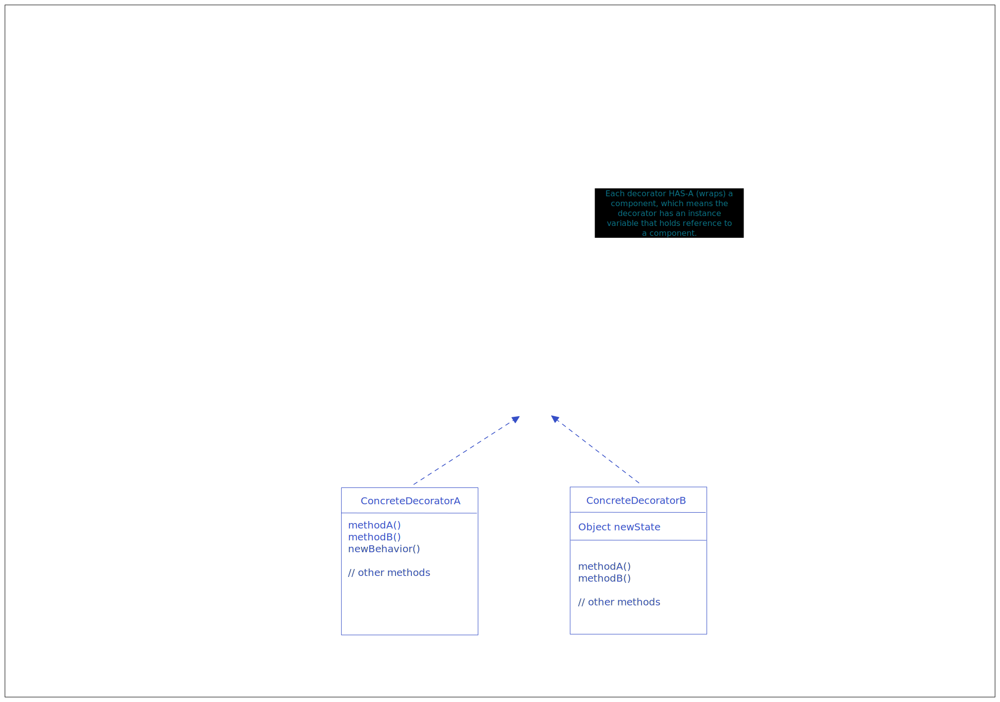

## Decorator Pattern

Decorator Pattern attaches additional responsibilities to an object dynamically.  
Decorators provide a flexible alternative to subclassing for extending functionality.  

Decorators need to implement the same type/interface as the `Component` does, as it has to stand in place of the component itself.  

Decorators can add new methods or extend the existing methods, however, new behavior is typically added by doing computation before or after an existing method in the component.  





```ts
abstract class Component {

    methodA()
    methodB()

    // other methods
}

class ConcreteComponent {

    methodA()
    methodB()

    // other methods
}

class Decorator extends Component {

    component: Component; // this makes Decorator class extend Component

    constructor(component) {
        this.component = component;
    }

    methodA()
    methodB()

    // other methods
}

class ConcreteDecoratorA extends Decorator {

    methodA()
    methodB()

    newBehavior()
    // other methods
}

class ConcreteDecoratorB extends Decorator {

    newState: object;

    methodA()
    methodB()

    newBehavior()
    // other methods
}

```

### Caveats

Decorators can result in many small objects in our design, and overuse can be complex.

If the code is dependent on the concrete types, then it is not advisable to use decorators.  


<script src="https://utteranc.es/client.js"
  repo="umakantv/design-patterns"
  issue-term="pathname"
  label="Comment"
  theme="preferred-color-scheme"
  crossorigin="anonymous"
  async>
</script>