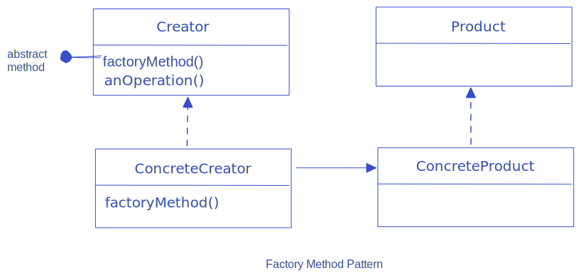
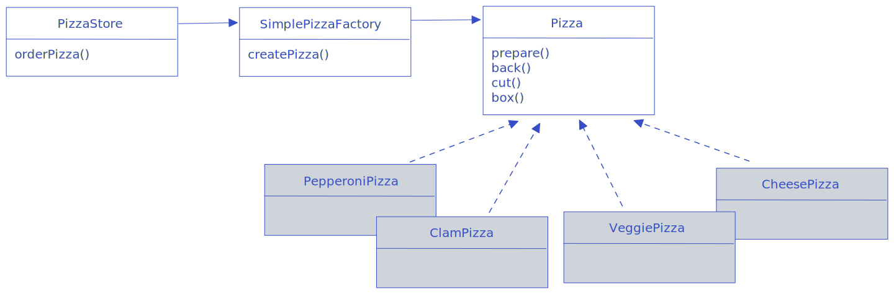
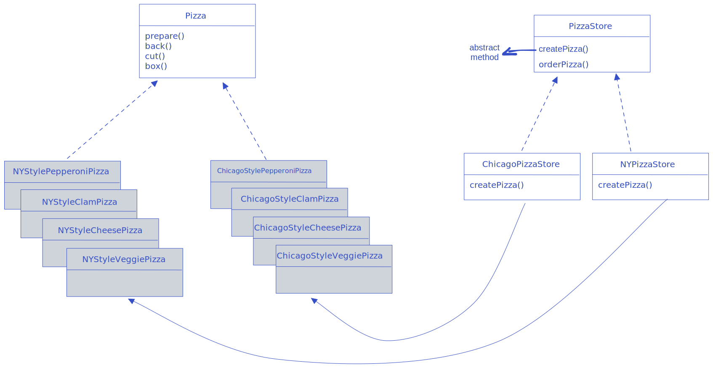

## Factory Method Pattern

The Factory Method Pattern defines an interface for creating an object, but lets subclasses decide which class to instantiate. Factory Method lets a class defer instantiation to subclass.  

Factory Methods helps us adhere to **Dependency Inversion Principle** by depending upon high-level abstractions instead of concrete classes, and designing to interface and not worry about concrete classes from high-level code.  

### Simple Factory

Simple Factory is a class that encapsulates creation of concrete classes. 

### Pizza-Factory Class Diagram

